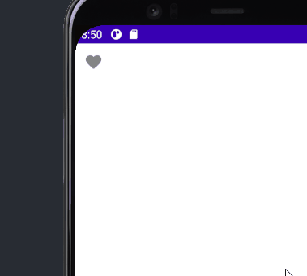

`animate*AsState` 函数是 `Compose` 中最简单的动画 `API`，用于为单个值制作动画。你只需提供结束值（或目标值），API 就会从当前值到指定值开始动画。


## 1. 简单使用

下面是一个使用这个 `API` 制作按钮大小动画的例子。

``` kotlin
@Composable
fun Demo(){
    var change by remember{ mutableStateOf(false) }
    var flag by remember{ mutableStateOf(false) }

    val buttonSize by animateDpAsState(
        targetValue = if(change) 32.dp else 24.dp
    )
    if(buttonSize == 32.dp) {
        change = false
    }
    IconButton(
        onClick = {
            change = true
            flag = !flag
        }
    ) {
        Icon(Icons.Rounded.Favorite,
            contentDescription = null,
            modifier = Modifier.size(buttonSize),
            tint = if(flag) Color.Red else Color.Gray
        )
    }
}
```



注意，你不需要创建任何动画类的实例，也不需要处理中断。在背后，一个动画对象（即一个 `Animatable` 实例）将被创建，并被记住在调用地点，以第一个目标值作为其初始值。从那以后，任何时候你给这个 `Composable` 对象提供一个不同的目标值，一个动画就会自动开始向那个值发展。如果已经有一个动画在运行，这个动画就会从它的当前值（和速度）开始，然后向目标值动画。在动画过程中，这个 `Composable` 东西被重新组合，每一帧都返回一个更新的动画值。

开箱即用，`Compose` 为 `Float`、`Color`、`Dp`、`Size`、`Bounds`、`Offset`、`Rect`、`Int`、`IntOffset` 和 `IntSize` 提供 `animate*AsState` 函数。通过为带有通用类型的 `animateValueAsState` 提供 `TwoWayConverter`，可以轻松添加对其他数据类型的支持。

你可以通过提供一个 `AnimationSpec` 来定制动画规格。请参阅 [AnimationSpec]() 以了解更多信息
