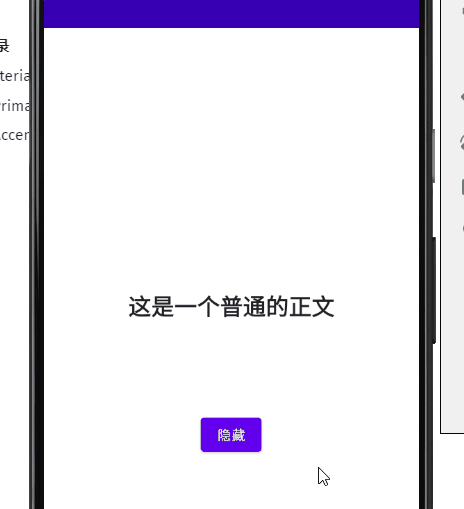
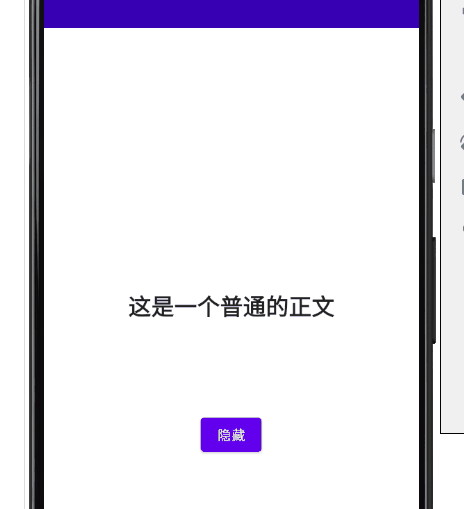

``` kotlin
@ExperimentalAnimationApi
@Composable
fun ColumnScope.AnimatedVisibility(
    visible: Boolean,
    modifier: Modifier = Modifier,
    enter: EnterTransition = fadeIn() + expandVertically(),
    exit: ExitTransition = fadeOut() + shrinkVertically(),
    initiallyVisible: Boolean = visible,
    content: @Composable () -> Unit
) {
    AnimatedVisibilityImpl(visible, modifier, enter, exit, initiallyVisible, content)
}
```

## 1. 基础用法

``` kotlin

var state by remember{ mutableStateOf(true)}

Column(
    modifier = Modifier
        .fillMaxSize(),
    horizontalAlignment = Alignment.CenterHorizontally,
    verticalArrangement = Arrangement.Center
){
    AnimatedVisibility(visible = state) {
        Text(
            text = "这是一个普通的正文",
            fontWeight = FontWeight.W900,
            style = MaterialTheme.typography.h5
        )
    }
    Spacer(Modifier.padding(vertical = 50.dp))
    Button(onClick = {state = !state}) {
        Text(if(state) "隐藏" else "显示")
    }
}

```


## 2. 进场动画

让我们来试试 `AnimatedVisibility` 中的 `Enter` 参数的简单使用吧！

``` kotlin
var state by remember{ mutableStateOf(true)}
AnimatedVisibility(
    visible = state,
    enter = slideInVertically(
        initialOffsetY = { - 1000 },
        animationSpec = tween(durationMillis = 1200)
    )
) {
    Text(
        text = "这是一个普通的正文",
        fontWeight = FontWeight.W900,
        style = MaterialTheme.typography.h5
    )
}
```



``` kotlin
enter:EnterTransition = fadeIn() + expandVertically()

sealed class EnterTransition
```

`EnterTransition` 定义了当一个 `AnimatedVisibility` ***Composable***  变得可见时，它是如何出现在屏幕上的

现可用的 3 种 `EnterTransition` 的类别分别是：

1. fade `fadeIn`
2. slide：`slideIn`, `slideInHorizontally`, `slideInVertically`
3. expand：`expandIn`, `expandHorizontally`, `expandVertically`

并且，它们之间能够进行加法运算，例如：

``` kotlin
var state by remember{ mutableStateOf(true)}
AnimatedVisibility(
    visible = state,
    enter = slideInVertically(
        initialOffsetY = { - 1000 },
        animationSpec = tween(durationMillis = 1200)
    ) + fadeIn(
        animationSpec = tween(durationMillis = 1200)
    )
) {
    Text(
        text = "这是一个普通的正文",
        fontWeight = FontWeight.W900,
        style = MaterialTheme.typography.h5
    )
}
```



!!! 注意
    `fadeIn` 和 `slideIn` 不影响 `AnimatedVisibility` **Composable**。相比之下，`expandIn` 将扩大剪辑范围以显示整个内容。这将自动地将其他的布局动画化，非常像 `Modifier.animateContentSize`


## 3. 更多

[AnimatedVisibility 参数详情](https://developer.android.com/reference/kotlin/androidx/compose/animation/package-summary#AnimatedVisibility(kotlin.Boolean,androidx.compose.ui.Modifier,androidx.compose.animation.EnterTransition,androidx.compose.animation.ExitTransition,kotlin.Boolean,kotlin.Function0))