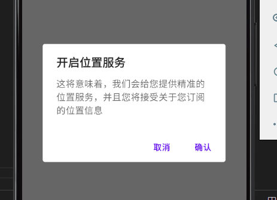
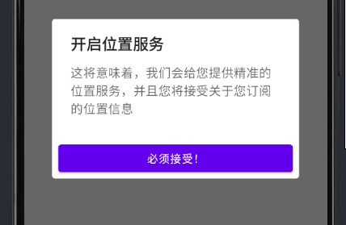

``` kotlin
@Composable
fun AlertDialog(
    onDismissRequest: () -> Unit,
    buttons: @Composable () -> Unit,
    modifier: Modifier = Modifier,
    title: (@Composable () -> Unit)? = null,
    text: @Composable (() -> Unit)? = null,
    shape: Shape = MaterialTheme.shapes.medium,
    backgroundColor: Color = MaterialTheme.colors.surface,
    contentColor: Color = contentColorFor(backgroundColor),
    properties: DialogProperties = DialogProperties()
)
```

[Material Design AlertDialog](https://material.io/components/dialogs#alert-dialog)

## 1. 简单使用

``` kotlin
val openDialog = remember { mutableStateOf(true) }

if (openDialog.value) {
    AlertDialog(
        onDismissRequest = {
            // 当用户点击对话框以外的地方或者按下系统返回键将会执行的代码
            openDialog.value = false
        },
        title = {
            Text(
                text = "开启位置服务",
                fontWeight = FontWeight.W700,
                style = MaterialTheme.typography.h6
            )
        },
        text = {
            Text(
                text = "这将意味着，我们会给您提供精准的位置服务，并且您将接受关于您订阅的位置信息",
                fontSize = 16.sp
            )
        },
        confirmButton = {
            TextButton(
                onClick = {
                    openDialog.value = false
                },
            ) {
                Text(
                    "确认",
                    fontWeight = FontWeight.W700,
                    style = MaterialTheme.typography.button
                )
            }
        },
        dismissButton = {
            TextButton(
                onClick = {
                    openDialog.value = false
                }
            ) {
                Text(
                    "取消",
                    fontWeight = FontWeight.W700,
                    style = MaterialTheme.typography.button
                )
            }
        }
    )
}
```

如果一切顺利，运行程序，您将会看到：



`AlertDialog` 将根据可用空间来定位其按钮。默认情况下，它将尝试将它们水平地放在彼此的旁边，如果没有足够的空间，则退回到水平放置。还有另一个版本的 Composable，它有一个按钮槽，可以提供自定义的按钮布局

``` kotlin
@Composable
fun AlertDialog(
    onDismissRequest: () -> Unit,
    buttons: () -> Unit,
    modifier: Modifier = Modifier,
    title: () -> Unit = null,
    text: () -> Unit = null,
    shape: Shape = MaterialTheme.shapes.medium,
    backgroundColor: Color = MaterialTheme.colors.surface,
    contentColor: Color = contentColorFor(backgroundColor),
    properties: DialogProperties = DialogProperties()
): @Composable Unit
```

简单的一个实现代码：

``` kotlin
val openDialog = remember { mutableStateOf(true) }

if (openDialog.value) {
    AlertDialog(
        onDismissRequest = {
            openDialog.value = false
        },
        title = {
            Text(
                text = "开启位置服务",
                fontWeight = FontWeight.W700,
                style = MaterialTheme.typography.h6
            )
        },
        text = {
            Text(
                text = "这将意味着，我们会给您提供精准的位置服务，并且您将接受关于您订阅的位置信息",
                fontSize = 16.sp
            )
        },
        buttons = {
            Row(
                modifier = Modifier.padding(all = 8.dp),
                horizontalArrangement = Arrangement.Center
            ) {
                Button(
                    modifier = Modifier.fillMaxWidth(),
                    onClick = { openDialog.value = false }
                ) {
                    Text("必须接受！")
                }
            }
        }
    )
}
```




## 2. 更多
[AlertDialog 参数详情](https://developer.android.com/reference/kotlin/androidx/compose/material/package-summary#AlertDialog(kotlin.Function0,kotlin.Function0,androidx.compose.ui.Modifier,kotlin.Function0,kotlin.Function0,kotlin.Function0,androidx.compose.ui.graphics.Shape,androidx.compose.ui.graphics.Color,androidx.compose.ui.graphics.Color,androidx.compose.ui.window.DialogProperties))