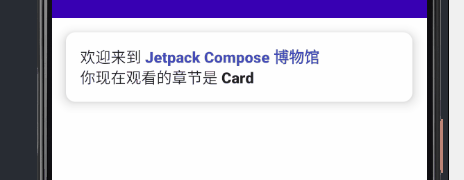

``` kotlin
@Composable
fun Surface(
    modifier: Modifier = Modifier,
    shape: Shape = RectangleShape,
    color: Color = MaterialTheme.colors.surface,
    contentColor: Color = contentColorFor(color),
    border: BorderStroke? = null,
    elevation: Dp = 0.dp,
    content: () -> Unit
): @Composable Unit
```


Material Surface 是 **Material Design** 的核心隐喻，每个平面都存在于一个特定的高度，这影响了这块平面在视觉上与其他平面的关系以及该平面如何投射阴影。

可以将 [`Surface`]() 理解成是一个容器，每个界面元素都基于这个容器，容器可以有不同的高度，可以位于不同的位置。

[`Surface`]() 主要负责：

1. 剪裁：[`Surface`]() 会根据 `shape` 属性所描述的形状来裁剪它的子元素。
2. 高度：[`Surface`]() 会绘制阴影来表示平面的深度，而这个深度由高度属性 (Elevation) 表示。如果传递的形状是凹进去的，那么在 Android 版本小于 **10** 的情况下，阴影不会被画出来。
3. 边框：如果形状有边框，那么它也会被画出来。
4. 背景：[`Surface`]() 在 `shape` 指定的形状上填充颜色。如果颜色是 `Colors.surface`，将使用 `LocalElevationOverlay` 中的 `ElevationOverlay` 来进行叠加--默认情况下，这只会发生在深色主题中。覆盖的颜色取决于这个 [`Surface`]() 的高度，以及任何父级 [`Surface`]() 设置的 `LocalAbsolutelevation`。这可以确保一个 [`Surface`]() 的叠加高度永远不会比它的祖先低，因为它是所有先前 [`Surface`]() 的高度的总和
5. 内容颜色：[`Surface`]() 使用 `contentColor` 为这个平面的内容指定一个首选的颜色--这个颜色被文本和图标组件作为默认颜色使用

如果没有设置 `contentColor`，这个平面将尝试将其背景颜色与主题 `Colors` 中定义的颜色相匹配，并返回相应的内容颜色。例如，如果这个平面的颜色是 `Colors.surface`，`contentColor` 将被设置为 `Colors.onSurface`。如果颜色不是主题调色板的一部分，`contentColor` 将保持这个 `Surface` 上面设置的相同值

## 1. 来试试用 `Surface` 实现 `Card` 的效果

``` kotlin
Surface(
    shape = RoundedCornerShape(10.dp),
    elevation = 10.dp,
    modifier = Modifier
        .fillMaxWidth()
        .padding(15.dp) // 外边距
){
    Column(
        modifier = Modifier
            .clickable{ }
            .padding(15.dp) // 内边距
    ) {
        Text(
            buildAnnotatedString {
                append("欢迎来到 ")
                withStyle(style = SpanStyle(fontWeight = FontWeight.W900, color = Color(0xFF4552B8))
                ) {
                    append("Jetpack Compose 博物馆")
                }
            }
        )
        Text(
            buildAnnotatedString {
                append("你现在观看的章节是 ")
                withStyle(style = SpanStyle(fontWeight = FontWeight.W900)) {
                    append("Card")
                }
            }
        )
    }
}
```




## 2. 更多

[Surface 参数详情](https://developer.android.com/reference/kotlin/androidx/compose/material/package-summary#Surface(androidx.compose.ui.Modifier,androidx.compose.ui.graphics.Shape,androidx.compose.ui.graphics.Color,androidx.compose.ui.graphics.Color,androidx.compose.foundation.BorderStroke,androidx.compose.ui.unit.Dp,kotlin.Function0))