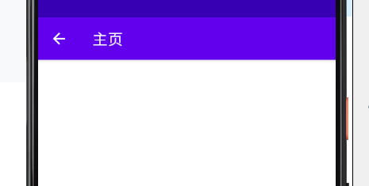

## `topBar`

`topBar` 是设置屏幕顶部的应用栏，我们可以考虑用自带的 `TopAppBar` 函数来实现

``` kotlin
@Composable
fun TopAppBar(
    title: @Composable () -> Unit,
    modifier: Modifier = Modifier,
    navigationIcon: @Composable (() -> Unit)? = null,
    actions: @Composable RowScope.() -> Unit = {},
    backgroundColor: Color = MaterialTheme.colors.primarySurface,
    contentColor: Color = contentColorFor(backgroundColor),
    elevation: Dp = AppBarDefaults.TopAppBarElevation
)
```

具体用法

``` kotlin
@Composable
fun ScaffoldDemo(){
    Scaffold(
        topBar = {
            TopAppBar(
                title = {
                    Text("主页")
                },
                navigationIcon = {
                    IconButton(onClick = {

                    }) {
                        Icon(Icons.Filled.ArrowBack, null)
                    }
                }
            )
        },
    ){

    }
}
```



还可以设置 `TopAppBar` 中的 `actions` 参数

``` kotlin
@Composable
fun ScaffoldDemo(){
    Scaffold(
        topBar = {
            TopAppBar(
                title = {
                    Text("主页")
                },
                navigationIcon = {
                    IconButton(onClick = {

                    }) {
                        Icon(Icons.Filled.ArrowBack, null)
                    }
                },
                actions = {
                    IconButton(onClick = {

                    }) {
                        Icon(Icons.Filled.Search, null)
                    }
                    IconButton(onClick = {

                    }) {
                        Icon(Icons.Filled.MoreVert, null)
                    }
                }
            )
        },
    ){

    }
}
```

它会将里面的内容以 `Row` 的方式来排列


