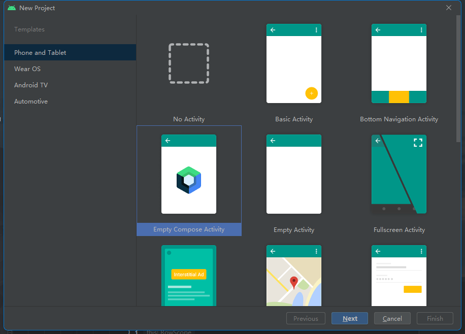

在开始用 Jetpack Compose 来编写软件时，我们需要

### 1. 一台可以 **联网** 的电脑
### 2. **安装或更新到** [最新版的 Android Studio](https://developer.android.com/studio)
### 3. 选择创建 **Empty Compose Activity** 

### 4. 保持版本更新

尝试使用最新的 [Compose 版本](https://developer.android.com/jetpack/androidx/releases/compose)和 Compose 要求的 Kotlin 版本 (1.5.21)

`Gradle 版本`: [7.2](https://mvnrepository.com/artifact/com.android.tools.build/gradle?repo=google)

可手动在 `gradle-wrapper.properties` 中更新

```
distributionUrl=https\://services.gradle.org/distributions/gradle-7.2-bin.zip
```

`build.gralde.kts (Project)`

```kotlin
buildscript {

    val compose_version by extra("1.0.2") // Compose 版本

    repositories {
        google()
        mavenCentral()
    }
    dependencies {
        // 7.1.0-alpha07 要求 Android Studio 2021.1.1 版本及以上
        classpath("com.android.tools.build:gradle:7.1.0-alpha11")

        // Kotlin 版本，注意：Compose 版本有时候需要要求 Kotlin 到达一定的版本，请同步更新
        classpath("org.jetbrains.kotlin:kotlin-gradle-plugin:1.5.21")

        // NOTE: Do not place your application dependencies here; they belong
        // in the individual module build.gradle.kts files
    }
}
```

`build.gradle (Project)`

```kotlin
buildscript {
    ext {
        compose_version = '1.0.2'
    }
    repositories {
        google()
        mavenCentral()
    }
    dependencies {
        classpath 'com.android.tools.build:gradle:7.1.0-alpha11'
        classpath "org.jetbrains.kotlin:kotlin-gradle-plugin:1.5.21"

        // NOTE: Do not place your application dependencies here; they belong
        // in the individual module build.gradle files
    }
}
```


### 5. 配置 Gradle（可忽略）

您需要将应用的最低 API 级别设置为 21 或更高级别，并在应用的 build.gradle 文件中启用 Jetpack Compose，如下所示。另外还要设置 Kotlin 编译器插件的版本。

`build.gradle`

```kotlin
plugins {
    id 'com.android.application'
    id 'org.jetbrains.kotlin.android'
}

android {
    compileSdk 31

    defaultConfig {
        applicationId "yourAppId"
        minSdk 21
        targetSdk 31
        versionCode 1
        versionName "1.0"

        testInstrumentationRunner "androidx.test.runner.AndroidJUnitRunner"
        vectorDrawables {
            useSupportLibrary true
        }
    }

    buildTypes {
        release {
            minifyEnabled false
            proguardFiles getDefaultProguardFile('proguard-android-optimize.txt'), 'proguard-rules.pro'
        }
    }
    compileOptions {
        sourceCompatibility JavaVersion.VERSION_1_8
        targetCompatibility JavaVersion.VERSION_1_8
    }
    kotlinOptions {
        jvmTarget = '1.8'
    }
    buildFeatures {
        compose true
    }
    composeOptions {
        kotlinCompilerExtensionVersion compose_version
    }
    packagingOptions {
        resources {
            excludes += '/META-INF/{AL2.0,LGPL2.1}'
        }
    }
}

dependencies {
    implementation 'androidx.core:core-ktx:1.6.0'
    implementation "androidx.compose.ui:ui:$compose_version"
    implementation "androidx.compose.material:material:$compose_version"
    implementation "androidx.compose.ui:ui-tooling-preview:$compose_version"
    implementation 'androidx.lifecycle:lifecycle-runtime-ktx:2.3.1'
    implementation 'androidx.activity:activity-compose:1.3.1'
    testImplementation 'junit:junit:4.13.2'
    androidTestImplementation 'androidx.test.ext:junit:1.1.3'
    androidTestImplementation 'androidx.test.espresso:espresso-core:3.4.0'
    androidTestImplementation "androidx.compose.ui:ui-test-junit4:$compose_version"
    debugImplementation "androidx.compose.ui:ui-tooling:$compose_version"
}
```

### 6. 编写第一个 **Compose** 程序
现在，如果一切都正常，我们可以看到，**MainActivity.kt** 上显示以下代码

``` kotlin
class MainActivity : ComponentActivity() {
    override fun onCreate(savedInstanceState: Bundle?) {
        super.onCreate(savedInstanceState)
        setContent {
            MyApplicationTheme { // 注意：这里会根据你创建的项目名而不同
                // A surface container using the 'background' color from the theme
                Surface(color = MaterialTheme.colors.background) {
                    Greeting("Android")
                }
            }
        }
    }
}

@Composable
fun Greeting(name: String) {
    Text(text = "Hello $name!")
}

@Preview(showBackground = true)
@Composable
fun DefaultPreview() {
    MyApplicationTheme {
        Greeting("Android")
    }
}
```
现在，我们将 **MainActivity.kt** 修改成以下：
``` kotlin
class MainActivity : ComponentActivity() {
    override fun onCreate(savedInstanceState: Bundle?) {
        super.onCreate(savedInstanceState)
        setContent {
            
        }
    }
}
```

在下一节的教程中，你将会通过添加不同的元素来构建一个简单的 app
