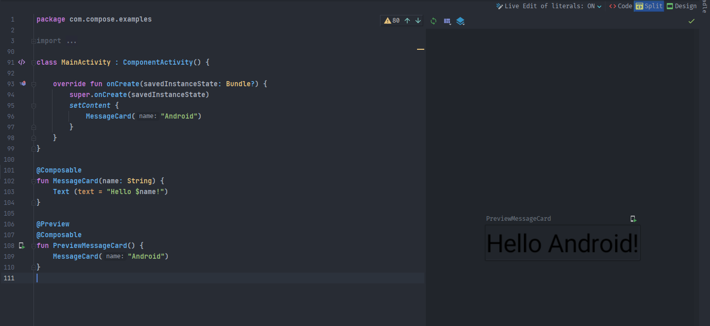
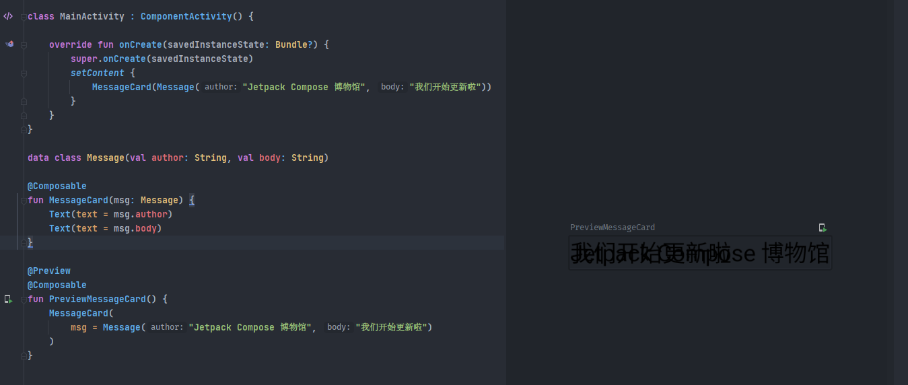
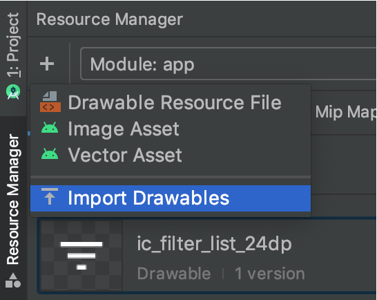
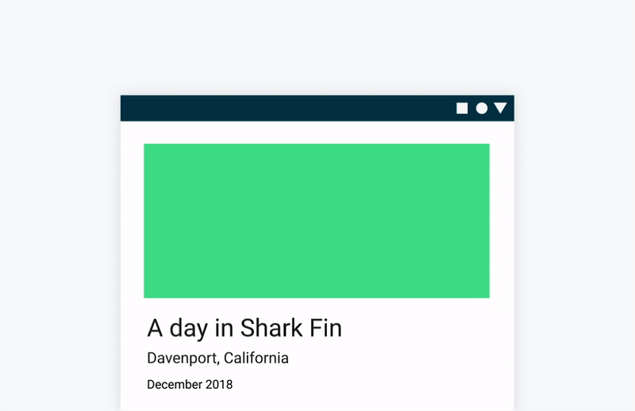
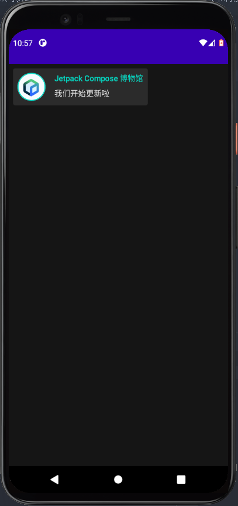
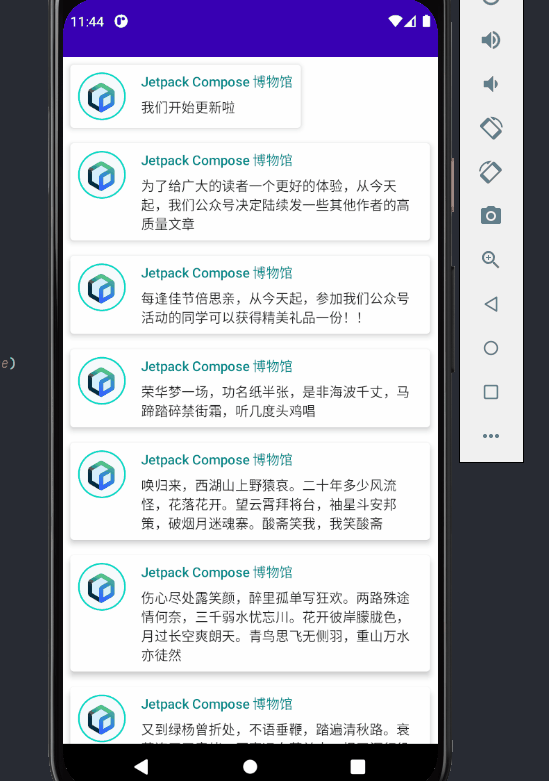
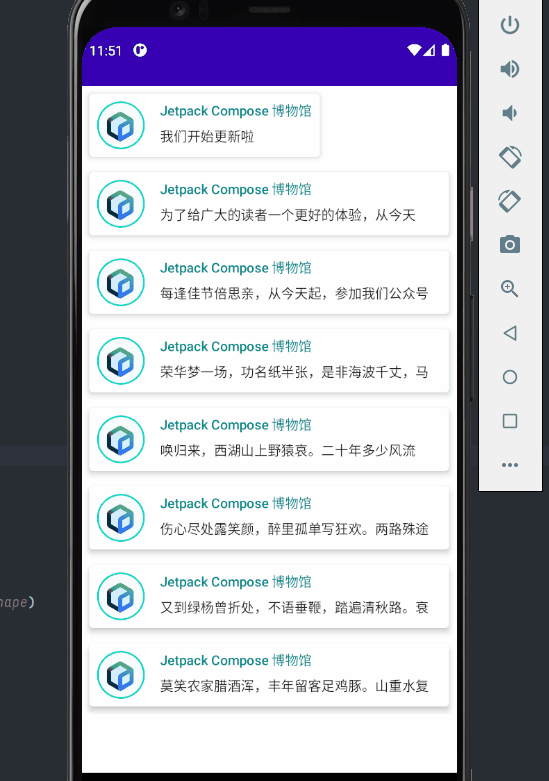

## 介绍

`Jetpack Compose` 是一个用于构建原生 `Android UI` 的现代工具包。`Jetpack Compose` 用更少的代码、强大的工具和直观的 `Kotlin API` 简化并加速了 `Android` 上的 `UI` 开发。

在本教程中，你将用声明式函数构建一个简单的 `UI` 组件。你将不会编辑任何 `XML` 布局或使用布局编辑器。相反，你将调用 `Jetpack Compose` 函数来说明你想要的元素，剩下的就由 `Compose` 编译器来完成。

!!! note "注意"
    请参阅 `Jetpack` [发布](https://developer.android.com/jetpack/androidx/versions/all-channel) 说明，了解最新的更新。

## 1. 第一步：Composable 函数

`Jetpack Compose `是围绕着 `Composable` 函数建立的。这些函数让你通过描述它的形状和数据依赖性，以编程方式定义你的应用程序的用户界面，而不是专注于用户界面的构建过程。要创建一个 `Composable` 函数，只需在函数名称中添加 `@Composable` 注解。


### 添加一个 Text 元素</h3>

首先，我们会在 onCreate 方法中添加一个 Text 元素来显示一个 "Hello World!" 的文本，你可以通过定义一个内容块，然后调用 `Text()` 函数来做到

setContent 块定义了一个我们可以调用 `Composable` 函数的 avtivity 的布局，Composable 函数只能从其他的 Composable 函数中调用

Jetpack Compose 使用一个 Kotlin 编译器插件来将这些 `Composable` 函数转化为应用程序的 `UI` 元素。例如，由 `Compose UI` 库定义的 `Text()` 函数就可以在屏幕上显示一个文本标签。


``` kotlin
class MainActivity : ComponentActivity() {
    override fun onCreate(savedInstanceState: Bundle?) {
        super.onCreate(savedInstanceState)
        setContent {
            Text("Hello world!")
        }
    }
}
```


### 定义一个 composable 函数

`Composable` 函数只能从其他 `Composable` 函数的范围内调用。要写一个 `Composable` 函数，我们需要添加一个 `@Composable` 的注解。为了更好的理解，我们可以定义一个 `MessageCard()` 函数，它包含了一个 `name` 参数，并使用这个参数来配置文本元素

``` kotlin
class MainActivity : ComponentActivity() {
    override fun onCreate(savedInstanceState: Bundle?) {
        super.onCreate(savedInstanceState)
        setContent {
            MessageCard("Android")
        }
    }
}

@Composable
fun MessageCard(name: String) { // Composable 函数一般用大写开头，为了和普通的函数作为区分
    Text(text = "Hello $name")
}
```


### 在 Android Studio 中预览你的函数

`Android Studio` 可以让你在 `IDE` 中预览你的 `Composable` 函数，而不需要将应用下载到 `Android` 设备或模拟器上。但是有个限制, 需要预览的 `Composable` 函数必须不能有任何参数。因为这个限制，你不能直接预览 `MessageCard()` 函数。但是，你可以尝试写第一个叫 `PreviewMessageCard()` 的函数，它调用带有参数的 `MessageCard()`。在 `@Composable` 之前添加 `@Preview` 注解。

``` kotlin
@Composable
fun MessageCard(name: String) {
    Text (text = "Hello $name!")
}

@Preview
@Composable
fun PreviewMessageCard() {
    MessageCard("Android")
}
```

重新运行你的项目，app 本身并没有改变，因为新的 `PreviewMessageCard()` 函数并没有在任何地方被调用，但 `Android Studio` 增加了一个预览窗口。这个窗口显示了由标有 `@Preview` 注解的 `Composable` 函数创建的 `UI` 元素的预览。如果你需要在任何时候更新预览，请点击预览窗口顶部的刷新按钮。



## 2. 第二步：界面

`UI` 元素是分层次的，元素包含在其他元素中。在 `Compose` 中，你可以通过从其他 `Composable` 函数中调用 `Composable` 函数来建立一个 `UI` 层次结构。


### 添加多个文本

到目前为止，我们已经建立了我们的第一个 Composable 的函数和预览! 为了发现更多的 Jetpack Compose 功能，我们将构建一个简单的消息屏幕，其中包含可以通过一些动画展开的消息列表。

让我们首先通过显示作者的名字和信息内容，使我们的 `MessageCard` 函数更丰富。我们首先需要改变我们的函数参数，接受一个消息对象而不是一个字符串，并在 `MessageCard` 函数中添加另一个 Text 函数。确保也要更新预览。



这段代码在 app 内创建了两个 Text 元素。然而，由于我们并没有安排如何排列它们，这两个 Text 元素重叠在了一块，使得我们无法阅读。

### 使用 Column

`Column` 函数可以让你垂直地排列元素,在 `MessageCard()` 函数中加入 `Column`。

你可以用 Row 来水平排列项目，用 Box 来堆叠元素。

``` kotlin
@Composable
fun MessageCard(msg: Message) {
    Column {
        Text(text = msg.author)
        Text(text = msg.body)
    }
}
```


### 添加一个 Image 元素

为了丰富我们的 `MessageCard`，我们可以添加一个头像，使用资源管理器来添加一张图片到工程中。

我们将会添加一个 `Row()` 函数来让我们有个良好的结构设计，并且我们的 Image 元素将会添加在这里面。



``` kotlin
@Composable
fun MessageCard(msg: Message) {
    Row {
        Image(
            painterResource(id = R.drawable.profile_picture),
            contentDescription = "profile picture" //这个描述用于无障碍
        )
        Column {
            Text(text = msg.author)
            Text(text = msg.body)
        }
    }
}
```


### 优化你的 UI

现在我们的布局有正确的结构，但是元素之间没有很好的间隔，而且左边的图片太大了，为了修饰和配置一个 Composable, Compose 使用了 `modifiers`，它们允许你改变 Composable 的尺寸、布局、外观或添加高级交互，比如可以让一个元素变得可以点击。你可以把它们连接起来，用来创建更丰富的 Composables，接下来就让我们使用其中一些来改善布局。

``` kotlin
@Composable
fun MessageCard(msg: Message) {
    Row(
        modifier = Modifier.padding(all = 8.dp) // 在我们的 Card 周围添加 padding
    ) {
        Image(
            painterResource(id = R.drawable.profile_picture),
            contentDescription = "profile picture",
            modifier = Modifier
                .size(50.dp) // 改变 Image 元素的大小
                .clip(CircleShape) // 将图片裁剪成圆形
        )
        Spacer(Modifier.padding(horizontal = 8.dp)) // 添加一个空的控件用来填充水平间距，设置 padding 为 8.dp
        Column {
            Text(text = msg.author)
            Spacer(Modifier.padding(vertical = 4.dp))
            Text(text = msg.body)
        }
    }
}
```


## 3. 第三步：Material design

`Compose` 是为支持 `Material design` 原则而建立的。它的许多 `UI` 元素都是开箱即用的 `Material design`。在这一步中，你将用 `Material` 小部件来设计你的应用程序。



### 使用 Material Design

我们的 `MessageCard` 现在有了一个布局，但它看起来还不是太好,

Jetpack Compose 提供了 Material Design 的实现，我们将使用 Material Design 的风格来改善我们的 `MessageCard`。

首先，我们使用在你的项目中创建的 Material 主题来包装我们的 MessageCard 函数，在我们的例子中是 ExamplesTheme。在 `@Preview` 和 `setContent` 中都添加它。

Material Design 是围绕三个元素建立的。颜色（Color）、排版（Typography）、形状（Shape）。让我们一个一个地添加它们。

``` kotlin hl_lines="4 13"
override fun onCreate(savedInstanceState: Bundle?) {
    super.onCreate(savedInstanceState)
    setContent {
        ExamplesTheme {
            MessageCard(Message("Jetpack Compose 博物馆", "我们开始更新啦"))
        }
    }
}

@Preview
@Composable
fun PreviewMessageCard() {
    ExamplesTheme {
        MessageCard(
            msg = Message("Jetpack Compose 博物馆", "我们开始更新啦")
        )
    }
}
```

!!! note "注意"
    一个空的 Compose Activity 已经自动为你的项目生成了一个默认的主题，允许你自定义 MaterialTheme。如果你给你的项目命名与 ExamplesTheme 不同，你可以在 ui.theme 包中找到你的自定义主题。

### 颜色（Color）

使用包装好的主题中的颜色进行修饰很容易，你可以在任何需要颜色的地方使用主题中的值。

让我们对标题进行修饰，并为图片添加边框。

```kotlin
Row(
    modifier = Modifier.padding(all = 8.dp)
) {
    Image(
        painterResource(id = R.drawable.profile_picture),
        contentDescription = "profile picture",
        modifier = Modifier
            .size(50.dp)
            .clip(CircleShape)
            .border(1.5.dp, MaterialTheme.colors.secondary, shape = CircleShape) // 添加边框
    )
    Spacer(Modifier.padding(horizontal = 8.dp))
    Column {
        Text(
            text = msg.author,
            color = MaterialTheme.colors.secondaryVariant // 添加颜色
        )
        Spacer(Modifier.padding(vertical = 4.dp))
        Text(text = msg.body)
    }
}
```


### 排版（Typography）

Material Typography 风格在 `MaterialTheme` 中是可用的，只要把它们添加到 Text composables 中。

``` kotlin
Column {
    Text(
        text = msg.author,
        color = MaterialTheme.colors.secondaryVariant,
        style = MaterialTheme.typography.subtitle2 // 添加 style
    )
    Spacer(Modifier.padding(vertical = 4.dp))
    Text(
        text = msg.body,
        style = MaterialTheme.typography.body2 // 添加 style
    )
}
```


### 形状（Shape）

有了形状，我们可以添加最后的修饰。我们为整个 `MessageCard` 实现了一个卡片式的设计

``` kotlin
@Composable
fun MessageCard(msg: Message) {
    Surface(
        shape = MaterialTheme.shapes.medium, // 使用 MaterialTheme 自带的形状
        elevation = 5.dp,
        modifier = Modifier.padding(all = 8.dp)
    ) {
        Row(
            modifier = Modifier.padding(all = 8.dp)
        ) {
            Image(
                painterResource(id = R.drawable.profile_picture),
                contentDescription = "profile picture",
                modifier = Modifier
                    .size(50.dp)
                    .clip(CircleShape)
                    .border(1.5.dp, MaterialTheme.colors.secondary, shape = CircleShape)
            )
            Spacer(Modifier.padding(horizontal = 8.dp))
            Column {
                Text(
                    text = msg.author,
                    color = MaterialTheme.colors.secondaryVariant,
                    style = MaterialTheme.typography.subtitle2
                )
                Spacer(Modifier.padding(vertical = 4.dp))
                Text(
                    text = msg.body,
                    style = MaterialTheme.typography.body2
                )
            }
        }
    }
}
```


### 启用深色主题

深色主题（或夜间模式）可以避免明亮的显示，特别是在晚上，或者只是为了节省设备的电池。由于支持 `Material Design`，Jetpack Compose 默认可以处理深色主题。在使用了 `Material` 颜色后，文本和背景将自动适应黑暗的背景。

你可以在你的文件中创建多个预览，作为单独的函数，或者在同一个函数中添加多个注解。

让我们添加一个新的预览注解并在手机上或者虚拟机上启用夜间模式。

``` kotlin
@Preview(name = "Light Mode")
@Preview(
    uiMode = Configuration.UI_MODE_NIGHT_YES,
    showBackground = true,
    name = "Dark Mode"
)
@Composable
fun PreviewMessageCard() {
    ExamplesTheme {
        MessageCard(
            msg = Message("Jetpack Compose 博物馆", "我们开始更新啦")
        )
    }
}
```



浅色和深色主题的颜色选择是在 IDE 生成的 Theme.kt 文件中定义的。

到目前为止，我们已经创建了一个 MessageCard 元素，它可以显示一个图像和两个不同风格的文本，而且在浅色和深色主题中都看起来很好


## 4. 列表和动画

### 创建一个列表消息卡片

到目前为止，我们只有一个消息的卡片，看上去有点单调，所以让我们来改善它，让它拥有多条信息。我们需要创建一个能够显示多条消息的函数。对于这种情况，我们可以使用 Compose 的 LazyColumn 和 LazyRow。这些 Composable 只渲染屏幕上可见的元素，所以它们的设计对于长列表来说很有效果。同时，它们避免了 RecyclerView 与 XML 布局的复杂性。

``` kotlin
import androidx.compose.foundation.lazy.items

@Composable
fun Conversation(messages: List<Message>) {
    LazyColumn {
        items(messages) { message ->
            MessageCard(msg = message)
        }
    }
}

@Composable
fun PreviewMessageCard() {
    ExamplesTheme {
        Conversation(messages = MsgData.messages)
    }
}

```



你可以在[这里](https://gist.github.com/Nthily/d7665503600d0499bf96a9521721c801) 获取 `MsgData` 的代码

在这个代码片段中，你可以看到 `LazyColumn` 有一个 items 子项。它接收一个 List 作为参数，它的 lambda 接收一个我们命名为 message 的参数（我们可以随便命名）。
而这个 lambda 将会调用每个 List 中里面提供的 item。

### 可交互的动画效果

我们的对话越来越有趣了，是时候玩玩动画了! 我们将会实现当点击一个卡片查看详细内容的时候，使内容的大小和背景颜色都有动画效果。为了存储这个本地 UI 状态，我们需要跟踪一条消息是否已经展开了。为了跟踪这种状态变化，我们必须使用 remember 和 mutableStateOf 函数。

Composable 函数可以通过使用 remember 将本地状态存储在内存中，并跟踪传递给 mutableStateOf 的值的变化。当值被更新时，使用该状态的 Composable 函数（及其子函数）将被自动重新绘制。我们把这称为重组（recomposition）。

通过使用 Compose 的状态 API，如 remember 和 mutableStateOf，任何对状态的改变都会自动更新 UI。

``` kotlin
@Composable
fun MessageCard(msg: Message) {

    var isExpanded by remember { mutableStateOf(false) } // 创建一个能够检测卡片十分被展开的变量

    Surface(
        shape = MaterialTheme.shapes.medium,
        elevation = 5.dp,
        modifier = Modifier
            .padding(all = 8.dp)
            .clickable { // 添加一个新的 Modifier 扩展方法，可以让元素具有点击的效果
                isExpanded = !isExpanded // 编写点击的事件内容
            }
    ) {
        Row(
            modifier = Modifier.padding(all = 8.dp)
        ) {
            Image(
                painterResource(id = R.drawable.profile_picture),
                contentDescription = "profile picture",
                modifier = Modifier
                    .size(50.dp)
                    .clip(CircleShape)
                    .border(1.5.dp, MaterialTheme.colors.secondary, shape = CircleShape)
            )
            Spacer(Modifier.padding(horizontal = 8.dp))
            Column {
                Text(
                    text = msg.author,
                    color = MaterialTheme.colors.secondaryVariant,
                    style = MaterialTheme.typography.subtitle2
                )
                Spacer(Modifier.padding(vertical = 4.dp))
                Text(
                    text = msg.body,
                    style = MaterialTheme.typography.body2,
                    // 修改 maxLines 参数，在默认情况下，只显示一行文本内容
                    maxLines = if (isExpanded) Int.MAX_VALUE else 1,
                    // Composable 大小的动画效果
                    modifier = Modifier.animateContentSize()
                )
            }
        }
    }
}
```



现在我们已经能够完成每个卡片的检测了，让我们继续使用 `isExpanded` 来做点其他的事情吧！比如改变卡片的颜色

``` kotlin
    // 创建一个能够根据 isExpanded 变量值而改变颜色的变量
    val surfaceColor by animateColorAsState(
        targetValue = if (isExpanded) Color(0xFFCCCCCC) else MaterialTheme.colors.surface
    )

    Surface(
        shape = MaterialTheme.shapes.medium,
        elevation = 5.dp,
        modifier = Modifier
            .padding(all = 8.dp)
            .clickable {
                isExpanded = !isExpanded
            },
        color = surfaceColor
    ) {
        ...
        ...
    }
```


## 5. 完成

恭喜你，看到这里
你已经学会了 `Compose` 的基础知识，你创建了一个简单的信息屏幕，并且有效地显示了一个包含图片和文字的列表，按照 Material Design 的风格设计，包括一个深色主题和预览，以下都是你通过 100 行以内的代码来完成的。

到目前为止你学到的内容

* 定义一个 `Composable` 函数
* 在你的 Composable 函数中添加不同的元素
* 使用布局 Composable 来构建你的 UI 结构
* 通过 modifiers 来扩展你的 Composables
* 创建一个有效列表
* 追踪状态，并且修改它
* 在一个 Composable 上添加了用户互动
* 在扩展信息的同时进行了动画处理

这篇文章的所有代码你可以在[这里](https://gist.github.com/Nthily/d5d6264900d2e45c8650e15d4b292c51)找到

如果你想深入了解其中的一些步骤，请探索下面的资源。

|设计||
|----|----|
|[布局概述](../layout/overview/)||
|[动画概述](../design/animation/overview/)||
|[主题概述](../design/theme/overview/)||
|[手势概述](../design/gesture/overview/)||
|[列表概述](../design/lists/overview/)||
